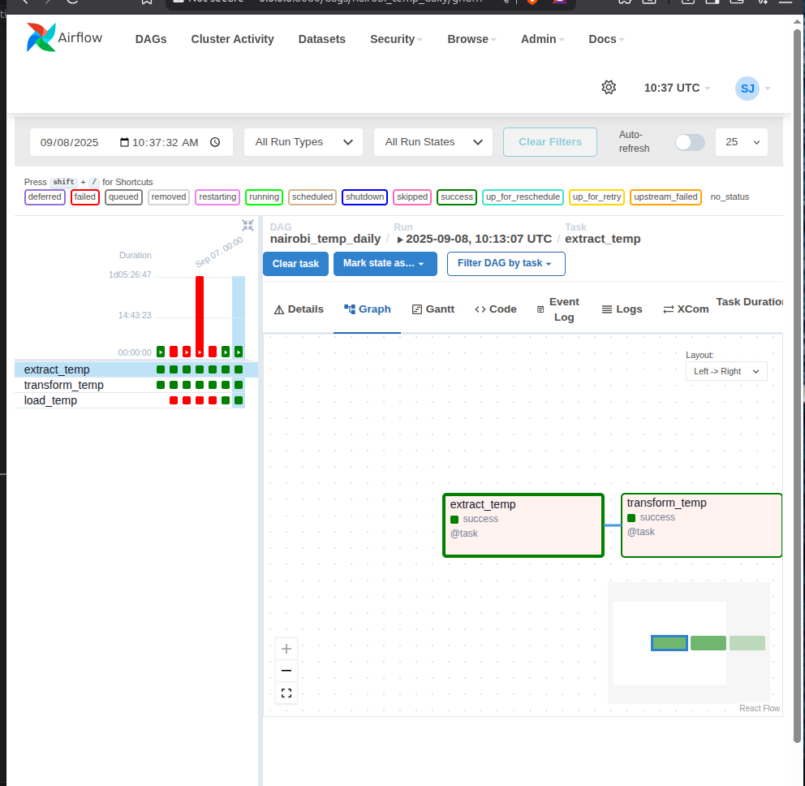

# Daily Temperature Tracker with Apache Airflow

## Table of Contents
- [Project Overview](#project-overview)
- [Architecture](#architecture)
- [Prerequisites](#prerequisites)
- [Setup Instructions](#setup-instructions)
- [DAG Implementation](#dag-implementation)
- [Running the Pipeline](#running-the-pipeline)
- [Results and Verification](#results-and-verification)
- [Monitoring and Troubleshooting](#monitoring-and-troubleshooting)
- [Future Enhancements](#future-enhancements)

## Project Overview

This project demonstrates a complete ETL (Extract, Transform, Load) pipeline using Apache Airflow to:
- **Extract** hourly temperature data for Nairobi from the Open-Meteo API
- **Transform** the JSON response into a structured CSV format
- **Load** the processed data into a PostgreSQL database
- **Schedule** the pipeline to run daily at midnight

### Key Learning Objectives
- Integrate real-time APIs with Airflow
- Implement DAGs and task orchestration
- Handle data persistence using CSV files and PostgreSQL
- Apply error handling and monitoring best practices

## Architecture

```
┌─────────────────┐    ┌─────────────────┐    ┌─────────────────┐
│   Open-Meteo    │───▶│   Airflow DAG   │───▶│   PostgreSQL    │
│      API        │    │                 │    │    Database     │
└─────────────────┘    └─────────────────┘    └─────────────────┘
                              │
                              ▼
                       ┌─────────────────┐
                       │   CSV Files     │
                       │ (Intermediate)  │
                       └─────────────────┘
```

### Data Flow
1. **Extract**: Fetch temperature data from Open-Meteo API
2. **Transform**: Parse JSON → Convert to DataFrame → Save as CSV
3. **Load**: Import CSV data into PostgreSQL table

## Prerequisites

### Software Requirements
- Python 3.8+
- Apache Airflow 2.0+
- PostgreSQL
- Required Python packages:
  ```bash
  pip install apache-airflow
  pip install apache-airflow-providers-postgres
  pip install pandas
  pip install requests
  ```

### System Setup
- Airflow webserver running on localhost:8080
- PostgreSQL database accessible with connection ID `my_postgres_conn`
- Write permissions to `/home/oliver/Downloads/` directory

## Setup Instructions

### 1. Database Connection Setup
Configure PostgreSQL connection in Airflow:
- Connection ID: `my_postgres_conn`
- Connection Type: `Postgres`
- Host: `localhost`
- Database: `your_database_name`
- Username: `your_username`
- Password: `your_password`


### 2. DAG File Placement
Place the DAG file in your Airflow DAGs folder:
```bash
cp nairobi_temp_daily.py $AIRFLOW_HOME/dags/
```

## DAG Implementation

### DAG Configuration
```python
@dag(
    dag_id="nairobi_temp_daily",
    schedule_interval="0 0 * * *",  # Daily at midnight
    start_date=datetime(2025, 9, 6),
    catchup=False,
    default_args=default_args,
    tags=["nairobi", "weather"]
)
```

### Task Breakdown

#### 1. Extract Task (`extract_temp`)
- **Purpose**: Fetch temperature data from Open-Meteo API
- **API Endpoint**: `https://api.open-meteo.com/v1/forecast?latitude=-1.2921&longitude=36.8219&hourly=temperature_2m`
- **Output**: JSON file saved to `/home/oliver/Downloads/nairobi_hourly_raw.json`
- **Error Handling**: Uses `response.raise_for_status()` for HTTP error detection

#### 2. Transform Task (`transform_temp`)
- **Purpose**: Convert JSON data to structured CSV format
- **Process**: 
  - Parse timestamps and temperature values
  - Create pandas DataFrame
  - Export to CSV format
- **Output**: CSV file saved to `/home/oliver/Downloads/nairobi_hourly_raw.csv`

#### 3. Load Task (`load_temp`)
- **Purpose**: Import CSV data into PostgreSQL
- **Database Operations**:
  - Create table if not exists
  - Truncate existing data (full refresh)
  - Use PostgreSQL COPY for efficient bulk loading
- **Table Schema**:
  ```sql
  CREATE TABLE IF NOT EXISTS nairobi_temperature (
      timestamp TIMESTAMP PRIMARY KEY,
      temperature FLOAT
  );
  ```

## Running the Pipeline

### 1. DAG Activation


1. Navigate to Airflow webserver (http://localhost:8080)
2. Locate `nairobi_temp_daily` DAG
3. Toggle the DAG to "On" state

### 2. Manual Trigger (Optional)
![DAG Trigger]
(images/trigger.png)

For testing purposes, manually trigger the DAG:
1. Click on the DAG name
2. Click "Trigger DAG" button
3. Confirm the trigger

### 3. Task Execution Flow


## Results and Verification

### 1. Task Execution Status


### 2. Log Verification


Key log messages to verify:
- Extract: "Status code 200" from API response
- Transform: "Transformed data saved to [/home/oliver/Downloads/nairobi_hourly_raw.csv]"
- Load: "Data loaded efficiently into PostgreSQL"

### 3. Database Verification


Verify data in PostgreSQL:
```sql
SELECT COUNT(*) FROM nairobi_temperature;
SELECT * FROM nairobi_temperature  LIMIT 10;
```

Expected results:
- Approximately 168 records (7 days × 24 hours)
- Temperature values in Celsius

### 4. File System Verification


Check generated files:
```bash
ls -la /home/oliver/Downloads/nairobi_hourly_raw.*
```

## Monitoring and Troubleshooting

### Common Issues and Solutions

#### 1. API Connection Issues
**Symptoms**: Extract task fails with connection timeout
**Solution**: Check internet connectivity and API availability
```python
# Add timeout parameter to requests
response = requests.get(url, timeout=30)
```

#### 2. Database Connection Issues
**Symptoms**: Load task fails with connection error
**Solution**: Verify PostgreSQL connection configuration


#### 3. File Permission Issues
**Symptoms**: Tasks fail with permission denied errors
**Solution**: Ensure Airflow user has write permissions to target directories

### Monitoring Dashboard

Key metrics to monitor:
- Task success rate
- Execution duration
- Data freshness (timestamp of latest record)

## Future Enhancements

### 1. Enhanced Error Handling
- Implement retry logic with exponential backoff
- Add email notifications for failures
- Create data quality checks

### 2. Data Retention Policy
```sql
-- Example: Keep only last 30 days of data
DELETE FROM nairobi_temperature 
WHERE timestamp < NOW() - INTERVAL '30 days';
```

### 3. Additional Metrics
Expand to include:
- Humidity
- Wind speed
- Precipitation
- Air pressure

### 4. Data Visualization
- Connect to Grafana or similar tool
- Create temperature trend dashboards
- Set up alerts for extreme temperatures

### 5. Performance Optimization
- Implement incremental loading
- Add data compression
- Use connection pooling

## Conclusion

This project successfully demonstrates:
- Real-time API integration with Airflow
- Structured ETL pipeline implementation
- Automated scheduling and orchestration
- Data persistence in PostgreSQL
- Error handling and monitoring capabilities

The pipeline provides a solid foundation for weather data collection and can be easily extended for additional use cases.

